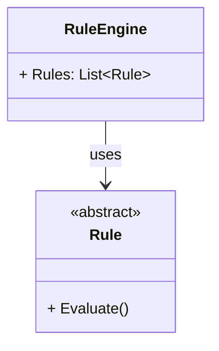

# Rule Pattern

#### What is rule pattern?
Set of rules applies for a produce result.

#### Use Cases
- Scoring Games
- Discount Calculation
- Fraud Detection
- Commission Calculation

#### What problem to solve?
open for extension, close for modification -OCP
Reduce the complexity of the code

#### Components
- Rule Engine
- Rule Collection
- Context(Input)

Adding rules could be done by ctor or adding/removing sets of rules via methods at runtime